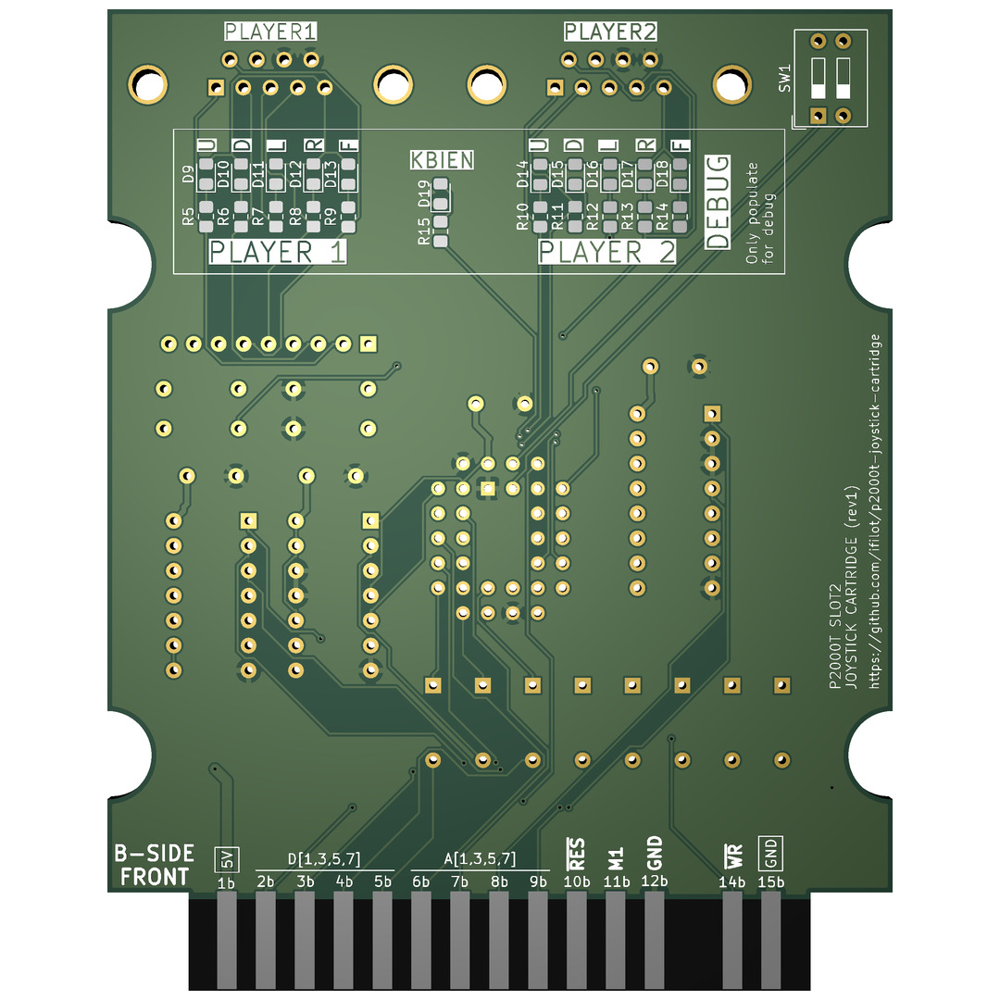
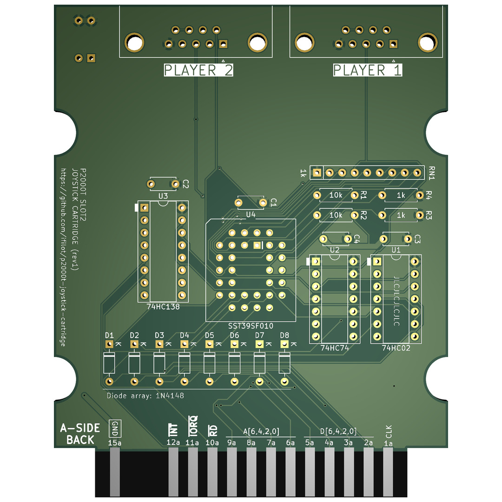

# P2000T Joystick Cartridge for SLOT2

This cartridge enables the use of Atari 2600-style joysticks with the P2000T by
emulating keyboard inputs. It uses an EEPROM and a few logic chips to translate
joystick button presses into keystrokes, seamlessly integrating with the
P2000T's keyboard polling process.

> [!TIP]
> Download a copy of the EEPROM binary [via this link](https://github.com/ifilot/p2000t-joystick-cartridge/releases/download/nightly/joystick_eeprom.bin).

## PCB

## Working

The P2000T features a matrix keyboard design, where each key is positioned at the intersection of a specific row and column. The rows are connected to the address pins, while the columns are connected to the data pins. The keyboard matrix consists of 10 rows and 8 columns.

## Keyboard Polling Process

To poll the keyboard, the P2000T employs a two-step process:

1. **Initialize Rows**: The P2000T writes a `1` to the `BIT6` position of I/O
   port `0x10`, which ties all rows to ground (GND).
2. **Detect Key Presses**: The P2000T then reads from I/O port `0x00`. If at
   least one key is pressed, the read value will differ from `0xFF`.

If a key press is detected, the P2000T proceeds with an additional step:

3. **Detect specific key**: Each row is sequentially pulled down by reading from
   I/O ports `0x00` to `0x0A`. A zero-bit received during any of these read
   operations indicates the presence of a key press. The corresponding key is
   mapped to a specific keystroke based on its position in the matrix.

The described process is emulated using a single EEPROM and a few logic chips.
The EEPROM’s address pins are connected to both the joystick buttons and the
lower address bus used by the P2000T during the keyboard polling process. To
detect the polling of the lines, a 74HC138 decoder is used. This decoder latches
the D6 pin to capture the first phase of the keyboard polling process. During
this phase, if any joystick button is pressed, the EEPROM generates the same
output as if a key on the keyboard had been pressed. In the second phase, the
EEPROM continues the emulation process. However, it now produces the output
precisely when the corresponding row in the keyboard matrix is pulled low.

The use of an EEPROM makes this process fully programmable, allowing the user to
create any desired joystick-to-keyboard mapping. With 10 joystick buttons (5 per
joystick across 2 ports), only 32 KiB of EEPROM memory is required to store the
mappings. Since even the smallest SST39SF0x0-type EEPROM has a capacity of 128
KiB, a single chip can accommodate up to four different joystick/keyboard
mappings. To enable users to select their preferred mapping, a DIP switch is
included, allowing easy switching between the stored configurations.

### Schematic

[Download schematic](pcb/p2000t-joystick-slot2-eeprom/p2000t-joystick-slot2-eeprom.pdf)

## Programming the EEPROM

To generate the data for the EEPROM, you can use [this
script](scripts/eeprom.py). The data can be written to the EEPROM using, for
example, [this hardware solution](https://github.com/ifilot/pico-sst39sf0x0-programmer).